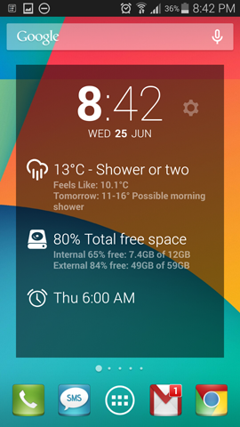

##  DashClock MyStorage Extension

[DashClock MyStorage Extension](https://play.google.com/store/apps/details?id=com.pixelus.dashclock.ext.mystorage) 
is an extension for the 
[DashClock Widget](https://play.google.com/store/apps/details?id=net.nurik.roman.dashclock) from Roman Nurik.

This extension shows both internal (device) and external (sdcard) storage in the widget.
Specifically, it provides:

+ Total percentage of free space across internal (device) and external (sdcard) storage
+ Detailed internal storage:
  * Free space %
  * Free physical space
  * Total physical space 
+ Detailed external storage (when sdcard available):
  * Free space %
  * Free physical space
  * Total physical space
  
&nbsp;&nbsp;

## Technical Details

This application is built using the [Maven Android Plugin](https://code.google.com/p/maven-android-plugin/).  See the 
[Getting Started Guide](https://code.google.com/p/maven-android-plugin/wiki/GettingStarted) for required environment 
pre-requisites and steps.

### Building a DEVELOPMENT apk:

To build a development apk, use the maven goal:
```
mvn clean install
```

### Deploying an apk to your device/emulator:

To deploy an apk to your connected device or emulator, use the maven goal:
```
mvn android:deploy
```

### Building a RELEASE apk:

When building a release version of the application, the generated artifacts will be suitable for uploading directly into 
the Google Playstore.  As such, the release build process will ensure that the code is shrunk, optimized and obfuscated
(using proguard), signed (certificate not included with this repo), and zip-aligned.  The resulting 
`target/mydevice-signed-aligned.apk` is then ready for upload into the playstore.  To initiate a new release, simply:

1. Bump maven version:  
   Update `pom.xml` to increment the applications version  
   
2. Bump the android version:  
   Update `AndroidManifest.xml` so that the application `versionName` and `versionCode` are incremented appropriately.
     
3. Commit the changes from steps 1 and 2 to source control  

4. Build a **release** apk using maven:  
   ```
   mvn clean install -P release
   ```